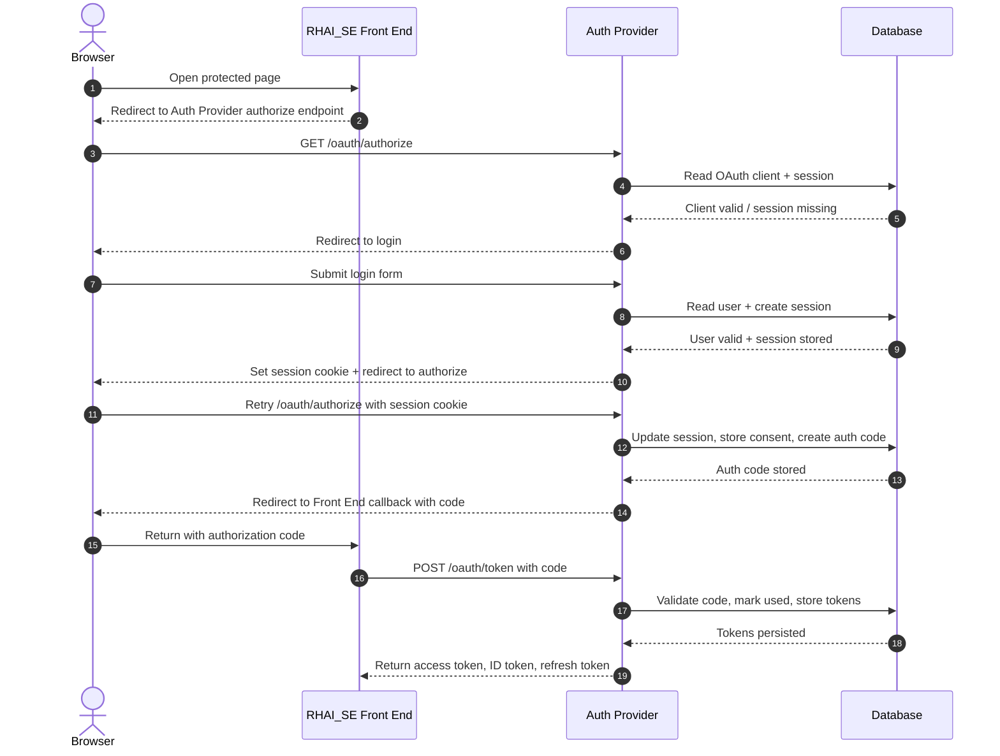
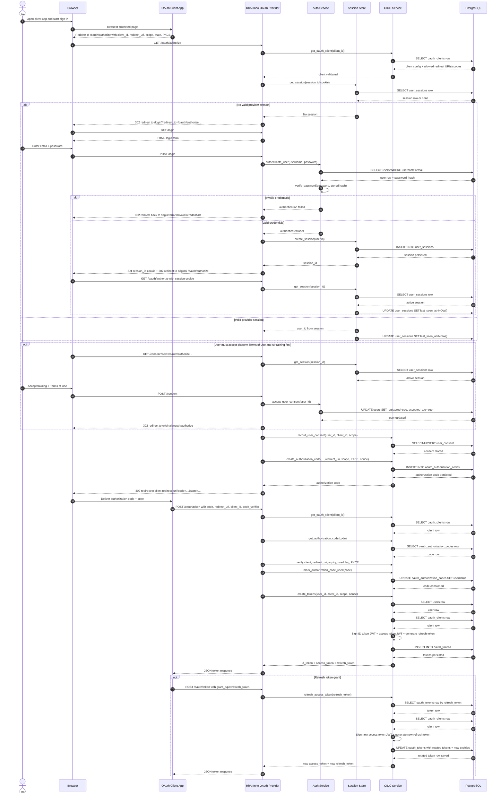

# Authentication Flow

## Simplified Sequence

Notes:

- Browser session state lives in `session_id` cookie, backed by `user_sessions`.
- Credential lookup and Terms of Use acceptance update `users`.
- Client metadata comes from `oauth_clients`.
- Authorization codes live in `oauth_authorization_codes` and are single-use.
- Access and refresh tokens are stored in `oauth_tokens` for validation, rotation, and revocation.
- OAuth scope consent is stored in `user_consent`; separate platform Terms of Use consent updates `users.accepted_tou`.
*** End Patch